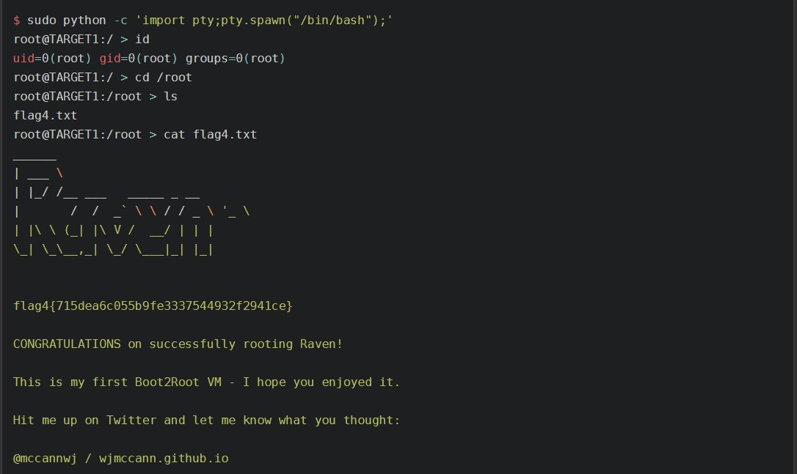

# Red Team: Summary of Operations

## Table of Contents
- Exposed Services
- Critical Vulnerabilities
- Exploitation

### Exposed Services

Nmap scan results for each machine reveal the below service details:

   ```bash
   $ nmap -Sv 192.168.1.110 
   ```
  

This scan identifies the services below as potential points of entry on Target 1:

  | Service | Version | Port |
  | :- | :- | :- |
  | ssh | Open SSH 6.7p1 | 22/TCP | 
  | http | Apache httpd 2.4.10 | 80/TCP |
  | rpcbind | 2-4 (RPC #100000) | 111/TCP |
  | netbios-ssn| Samba smbd 3.X-4.X | 139/TCP</br >445/TCP|

The following vulnerabilities were identified on Target 1:

  | Vulnerability | Description | Impact |
  | :- |:- | :- |
  | WordPress | Default configuration | allowed user enumeration and password brute force |
  | SSH | Poor/default configuration | gave the attacker remote access|
  | Passwords| Weak/default passwords | granted access to user logins and SQL database|
  | User Permissions | Weak/default permissions | allowed attacker to explore the filesystem and execute commands to exfiltrate data

### Exploitation

The Red Team was able to penetrate `Target 1` and retrieve the following confidential data:

  - `flag1.txt and flag2.txt`
     - **Exploit Wordpress**

      - Use WP scan to enumerate users and vulnerabilities 

      - `wpscan --url 192.168.1.110/wordpress -eu`
       
      

    - **Exploit SSH and weak passwords**
    
      - SSH into the target using one of the enumerated user names

      - I was able to guess Michael's password with only two tries. If I had failed after a few other common passwords I would have resorted to a brute force attack to gain a password. If I had to use a brute force attack I could have used `hydra`

      - `hydra -l michael -P /usr/share/wordlists/rockyou.txt 192.168.1.110 -t 4 ssh`
      

    - **Exploit user prmissions**

      - Because user access to the wordpress folders were unrestricted I was able to do a simple search for flags

      - `grep --color=auto -r flag[1-4] /var/www`
      


    - **Exploit user permissions**
      
      - Let's see what else we can find in Wordpress's folder structure. A configuration file might give us some hints at what else we can access easily

      - I used `cat` and tab autocomplete to quickly see what was in each folder before deciding which folders to "move" into.

        - `cat /var/www/html/wordpress/wp-config.php`
        

      - We have a database with a user and password, lets see whats inside by dumping the data base. This can be done with `mysqldump` or `mysql`. I prefer `mysqldump` because the output can be manipulated with stream editors. 

      - `mysqldump -u root -p --skip-extended-insert wordpress | grep --color=auto flag[3-4]`
      


    - Looks like we got a 2 for 1 bonus! we have achieved our goal with only use of  `nmap`, `wpscan`, `ssh`, `cat`, `grep` and `mysqldump`. 
    
  - Users via mysql search

    - Users and passwords via mysql database


        - We do a search through the database as follows:

        
        
        

        - The following command is a nice way to export information out of tables and into a file without the use of any other tools
        

      - Crack password hashes with `john`.

        - If you extracted the usernames and hashes with `mysql` then you can move the new file to the Kali machine via `scp`
          - `scp michael@192.168.1.110:/home/michael/users ./`
          
        
        - Next use `john` to crack the passwords
          - `john wp_hashes.txt`
         

        - steven's password is **pink84**


    - Gain Root

      
      - Through Steven

        - After finding Stevens login we can SSH into the machine with his credentials. 

        - We can see that Steven does not have a full shell to utilize but he does have python permissions.
        

        - We can use python to start a shell, and if we do it with root privileges we will be escalated to root in the newly spawned shell
        

        - 

